## Capitulo I - La eutrofización del Budi Leufu

El Lago Budi posee una fuerte influencia marina, proveniente del océano pacífico, generando aguas salobres que brindan condiciones únicas de hábitat a un gran número de especies, especialmente, sitios de anidamiento de avifauna endémica. Alrededor de este cuerpo de agua viven más de 7000 personas mapuche agrupadas en decenas de comunidades indígenas con un fuerte arraigo al territorio. El Budi Leufu, es un sitio prioritario según lo indicado en la ley 19.300, art. 11, letra d, y si bien, esta naturaleza jurídica se encuentra ratificada por el Ord. Nº 100143/2010 del SEA, actualmente no existe ningún instrumento de gestión para la protección y el monitoreo de parámetros sanitarios y ambientales de este único e importante cuerpo de agua.

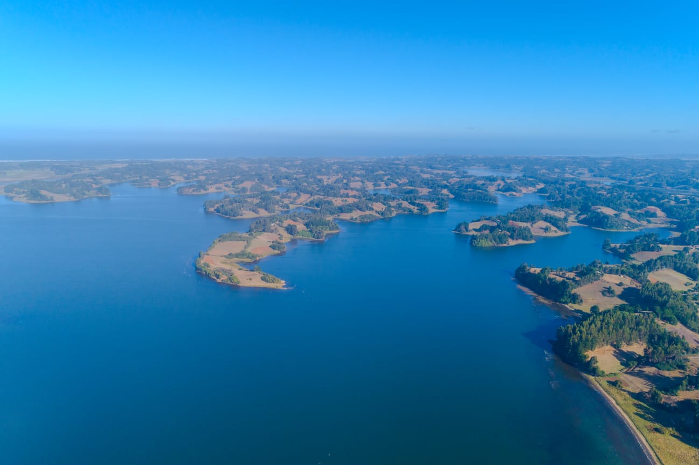

Durante los últimos 20 años, se ha evidenciado una proliferación anormal de algas y cianobacterias, con un aumento drástico de sedimentos nitrogenados y fosfatados acumulados en el lecho del lago, lo que ha provocado su gradual eutrofización (Beth, 2015). En 2024, la SEREMI de Salud Araucanía declaró riesgo sanitario en Puerto Domínguez debido a la alta concentración de coliformes fecales en las playas de esta localidad.

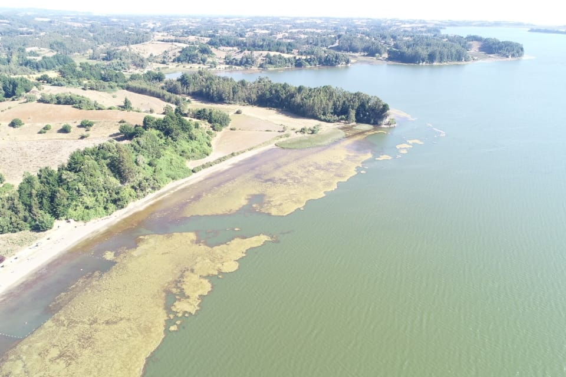

Me permito relevar, que no son solo las poblaciones humanas las afectadas por la eutrofización del Lago. Peces y aves, algunos endémicos de la Cuenca del Lago Budi se han visto afectados seriamente por la contaminación. Se estima que los aportes de los nutrientes que provocan la eutrofización del lago tienen su origen en el exceso de aplicación de fertilizantes sintéticos y la infiltración de aguas servidas debido a la ausencia de alcantarillado y PTAS que atiendan a los habitantes de Puerto Domínguez y el sector rural.

::: {layout-ncol="2"}
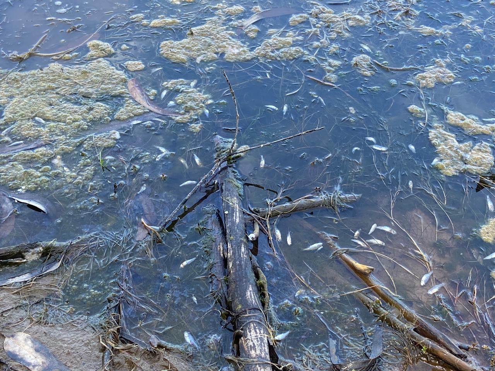

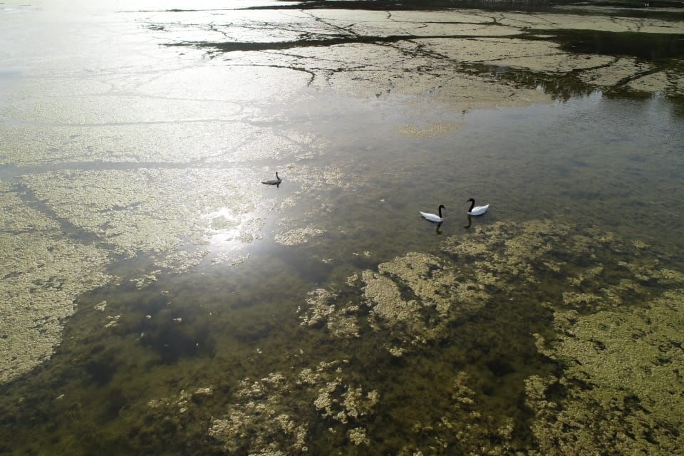{width="110%"}
:::

## Capítulo II - Campañas de monitoreo de calidad de agua

La iniciativa que diseñé, contempló la adquisición de equipos profesionales de medición multiparamétrica de la calidad del agua salobre y agua dulce, la compra de reactivos para el manejo y calibración de los equipos multiparamétricos, además de la adquisición de un caudalímetro para el aforo de afluentes superficiales de la cuenca.

::: {layout-ncol="2"}
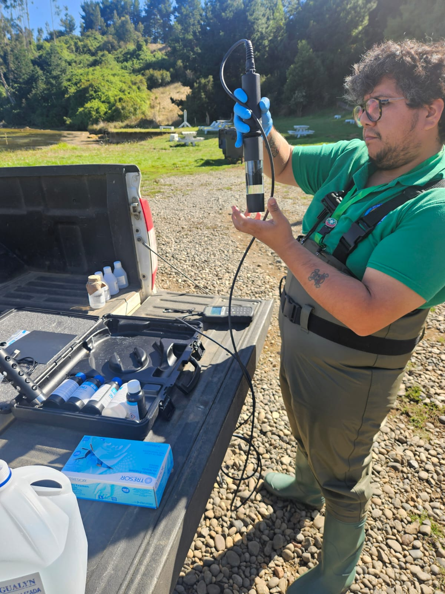

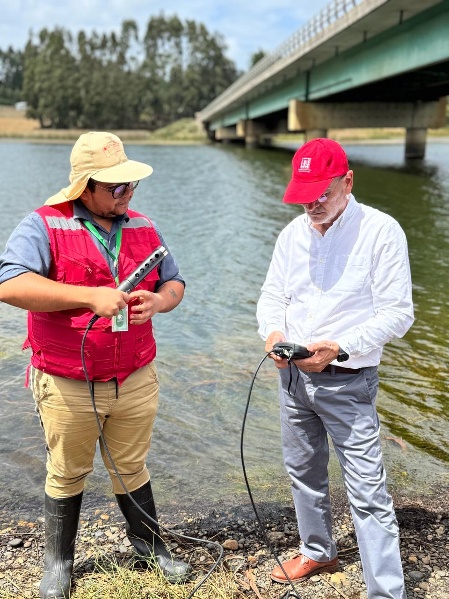
:::

El plan de monitoreo está siendo ejecutado de forma quincenal, midiendo y muestreando en cada campaña 10 puntos de la cuenca que coincidan con las descargas de los afluentes de mayor caudal al Lago Budi. Sin desmedro de ese protocolo, también se ha recopilado información en los sectores donde ha sucedido varamiento de ictiofauna. 

::: {layout-ncol="2"}
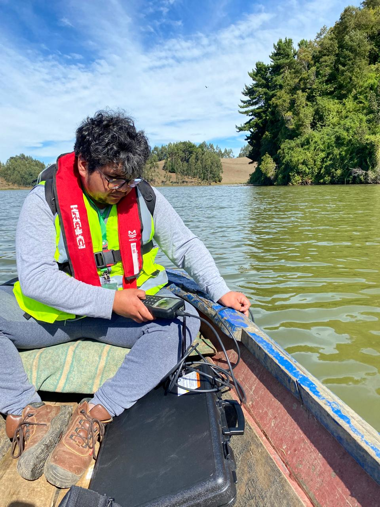

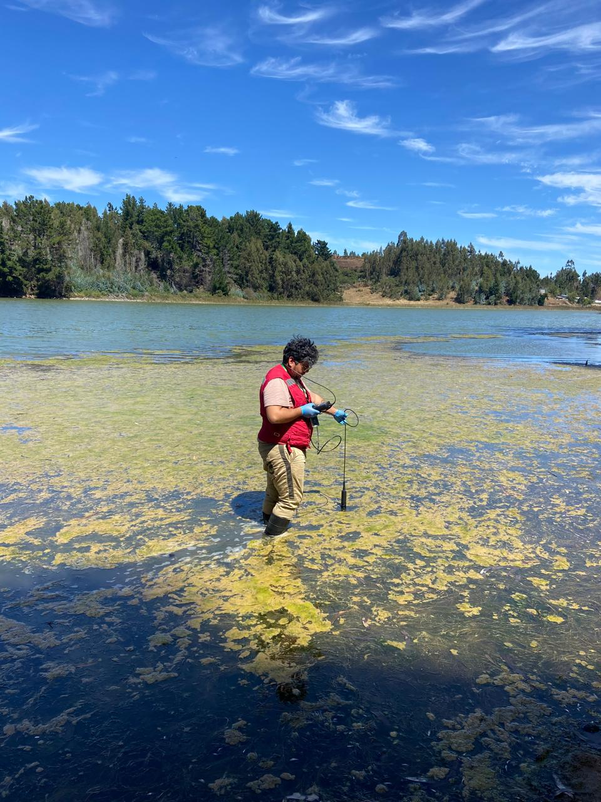
:::

El proyecto contempló levantar un programa de formación en calidad de agua mediante un llamado abierto a la comunidad. A la fecha se han intervenido 2 escuelas rurales y a la **Mesa Territorial de Pueblo Originarios**, a quienes se les ha capacitado para apoyar el programa de medición de parámetros y muestreo del agua a nivel territorial.

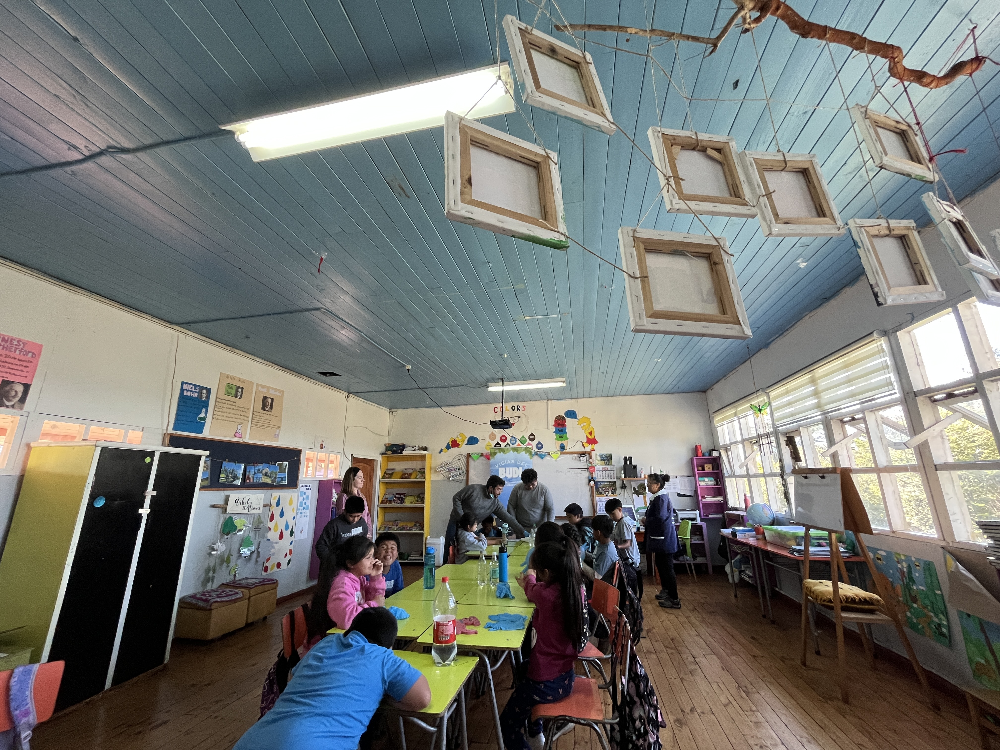

## Capítulo III - Cartografía interactiva de calidad de agua del Lago Budi

Uno de los resultados generados fue una cartografía interactiva que permite explorar mediciones de calidad de agua tomadas en el Lago Budi, comuna de Saavedra. La campaña cubrió **17 estaciones de muestreo** distribuidas a lo largo del cuerpo lacustre, con registros tanto en **superficie** como en **lecho**.

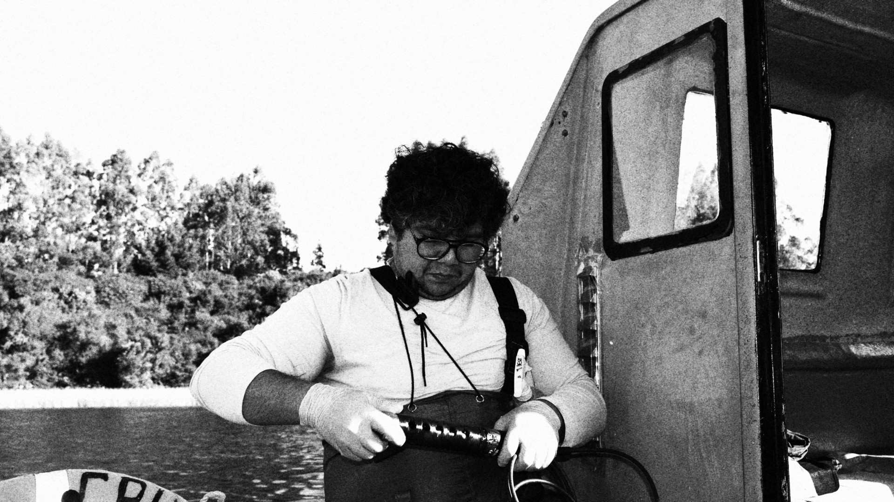

Para cada punto se midieron ocho parámetros mediante sensor multiparamétrico in situ: pH, oxígeno disuelto (mg/L y porcentaje de saturación), turbiedad (FNU), temperatura, potencial de oxidación-reducción (ORP), conductividad eléctrica, sólidos disueltos totales (TDS) y salinidad (PSU).

Los resultados se contrastan con los requisitos de la **Norma Chilena NCh1333.Of78 (modificada en 1987)**, en particular el Artículo 7.2.1, Tabla 3, correspondiente a aguas destinadas a recreación con contacto directo (natación, buceo, esquí acuático).

## Cómo usar el visualizador

En el panel lateral puedes:

- Seleccionar el **parámetro** a cartografiar.
- Cambiar entre vista de **superficie** y **lecho**.
- Cambiar el **mapa base** (calles, satélite, topográfico).
- Ver la **leyenda NCh1333** correspondiente al parámetro seleccionado, con bandas de cumplimiento.
- Consultar **estadísticos descriptivos** (mínimo, máximo, promedio) calculados sobre todas las estaciones.

Al hacer clic sobre cualquier estación se despliega un popup con todos los parámetros medidos en ese punto y su clasificación según la norma.

## Visualizador

::: column-screen-inset
<iframe src="webmap.html" width="100%" height="800px" style="border: 1px solid #2a3b5a; border-radius: 8px;" title="SIG Lago Budi - Cartografía de calidad de agua">

</iframe>
:::

[Abrir el visualizador en pestaña completa →](webmap.html){.btn .btn-primary target="_blank"}

## Notas metodológicas

**Sobre el equipo de medición**: las mediciones se realizaron con sensor multiparamétrico Hanna HI98594, calibrado previo a la jornada de campo. La precisión nominal de cada parámetro está dentro de los rangos aceptados para monitoreo ambiental de cuerpos de agua superficiales.

**Sobre el contexto del Lago Budi**: el Budi es una cuenca costera **mixohalina** —cuerpo de agua semi-cerrado con conexión periódica al océano— ubicado en territorio mapuche-lafkenche. Los valores de salinidad varían fuertemente entre sectores conectados al mar y sectores con aporte exclusivo de tributarios dulces. Esta heterogeneidad debe considerarse al interpretar los gradientes espaciales.

**Sobre la NCh1333**: la norma referida regula los requisitos de calidad de agua para distintos usos (consumo humano, riego, recreación, vida acuática). En este visualizador se aplica específicamente la tabla de uso recreativo con contacto directo. Para otros usos (riego, vida acuática), las bandas de cumplimiento son distintas.

**Sobre las limitaciones**: una campaña puntual de un día entrega una fotografía instantánea del estado del cuerpo de agua. Para conclusiones robustas sobre el comportamiento del lago es necesario monitoreo continuo o al menos campañas estacionales repetidas. Este visualizador documenta una jornada específica y debe leerse como tal.

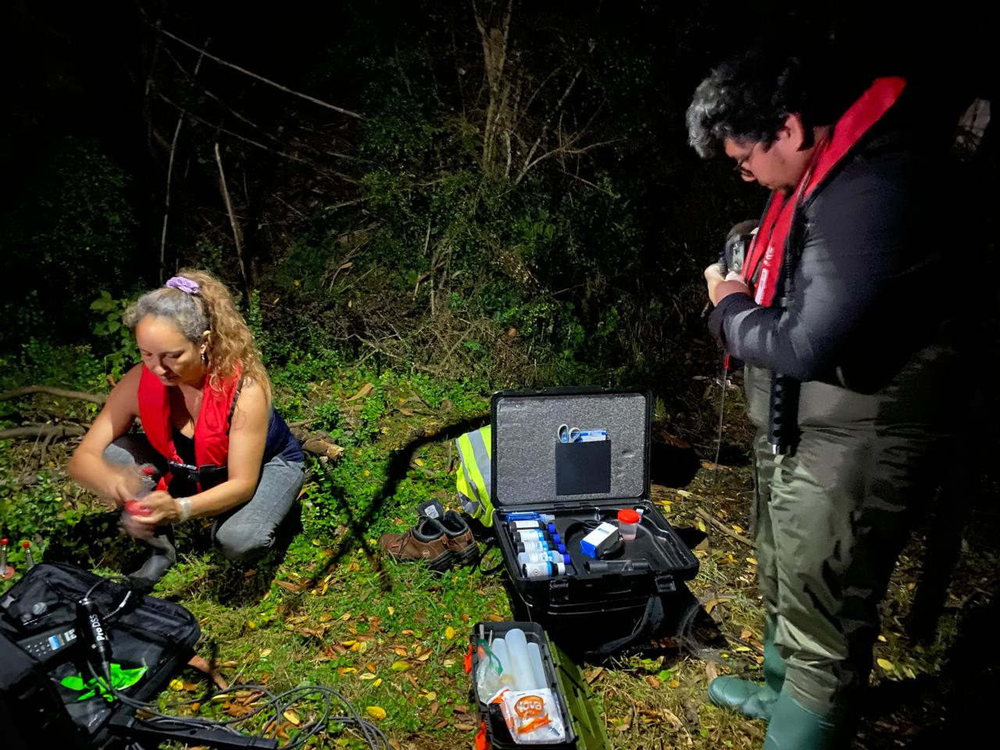

## Datos y reproducibilidad

Las coordenadas de las estaciones están en sistema **WGS84 (EPSG:32718)**. La geometría espacial fue capturada con GPS de mano, con precisión submétrica para fines cartográficos (no topográficos).

Si trabajas en gestión de cuerpos de agua y te interesa replicar este enfoque metodológico en otra cuenca, puedes escribirme a [fcorubilarrocha\@gmail.com](mailto:fcorubilarrocha@gmail.com).
